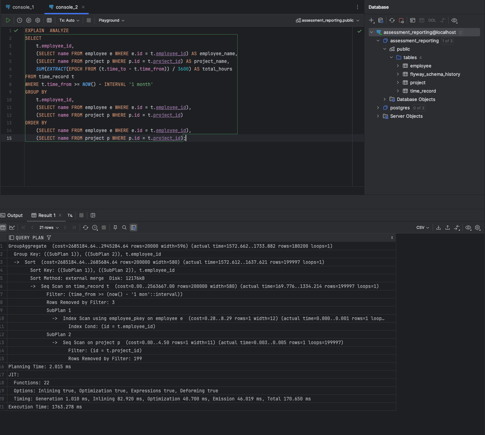
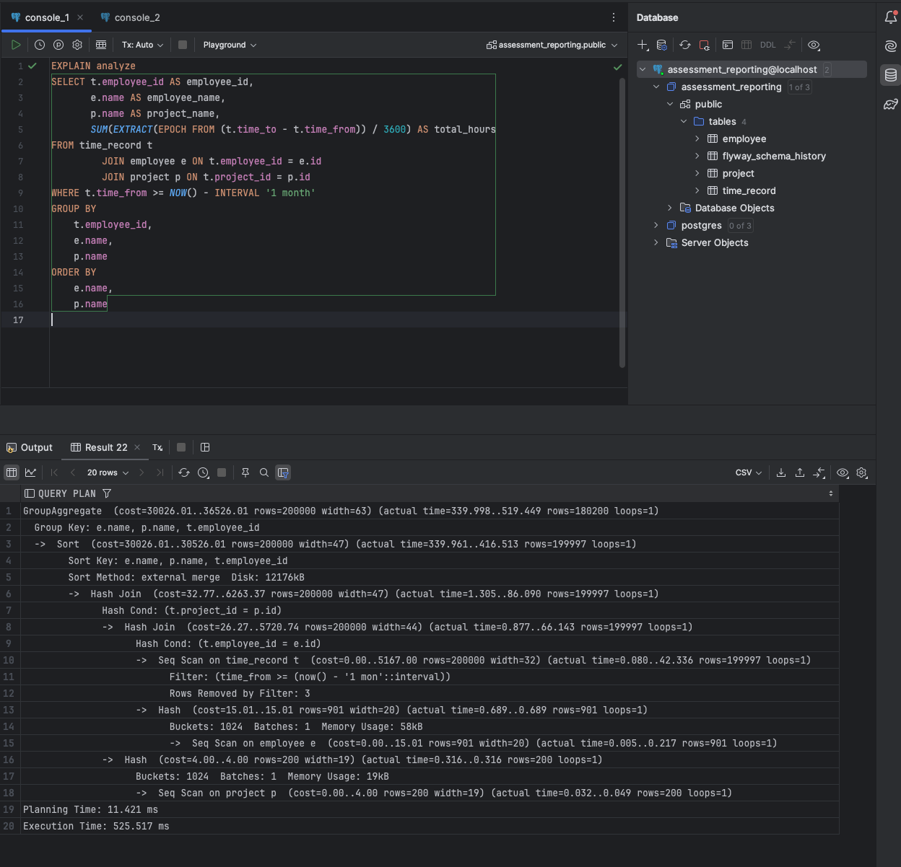

# Part 1: Database Query Optimization

## Overview

This document describes the optimization process applied to improve query performance. The optimization involved two primary approaches: query refactoring to eliminate correlated subqueries and implementing appropriate indexing strategies to reduce full table scans.

---

## Step 1: Test Data Generation

To accurately measure query performance characteristics, a substantial dataset was required. Initial sample data volumes were insufficient to identify performance bottlenecks or evaluate execution plan optimizations.

**Dataset Composition:**
- Employee entities: 901 records (ID range: 100-1000)
- Project entities: 200 records (ID range: 1-200)
- Time record entities: 200,000 records (relational tuples linking employees to projects with temporal attributes)

This dataset volume enables meaningful performance analysis by forcing the query engine to process a non-trivial result set and exercise optimization strategies.

---

## Step 2: Baseline Performance Analysis

The original query implementation exhibited significant performance degradation due to inefficient query structure. The initial query definition:

```sql
SELECT
    t.employee_id,
    (SELECT name FROM employee e WHERE e.id = t.employee_id) AS employee_name,
    (SELECT name FROM project p WHERE p.id = t.project_id) AS project_name,
    SUM(EXTRACT(EPOCH FROM (t.time_to - t.time_from)) / 3600) AS total_hours
FROM time_record t
WHERE t.time_from >= NOW() - INTERVAL '1 month'
GROUP BY
    t.employee_id,
    (SELECT name FROM employee e WHERE e.id = t.employee_id),
    (SELECT name FROM project p WHERE p.id = t.project_id)
ORDER BY
    (SELECT name FROM employee e WHERE e.id = t.employee_id),
    (SELECT name FROM project p WHERE p.id = t.project_id);
```

**Performance Bottlenecks Identified:**

1. **Correlated Subquery Anti-Pattern (N+1 Problem)**: The query executes separate SELECT statements for employee and project name resolution for each row in the result set. For a result set of 200,000 `time_record` rows, this results in 400,000 additional subquery executions (`employee` and `project`), creating significant overhead.

2. **Full Table Sequential Scan**: Absence of an index on the `time_from` column forces the query optimizer to perform a sequential scan operation, requiring the database engine to examine all table pages to identify records matching the temporal filter predicate.

3. **Inefficient Sorting Operations**: The ORDER BY clause references correlated subqueries, preventing the use of index-based sorting or in-memory optimization techniques. Each comparison operation requires subquery execution.

**Performance Metrics:**
- Execution Time: ~1763ms
- Execution Plan: Nested Loop with SubPlan operations
- Primary Bottleneck: CPU saturation from repeated subquery executions



---

## Step 3: Query Refactoring And Index Implementation

**Refactored Query Implementation:**

```sql
SELECT
    t.employee_id,
    e.name AS employee_name,
    p.name AS project_name,
    SUM(EXTRACT(EPOCH FROM (t.time_to - t.time_from)) / 3600) AS total_hours
FROM time_record t
JOIN employee e ON t.employee_id = e.id
JOIN project p ON t.project_id = p.id
WHERE t.time_from >= NOW() - INTERVAL '1 month'
GROUP BY t.employee_id, e.name, p.name
ORDER BY e.name, p.name;
```

**Index Schema:**

```sql
CREATE INDEX idx_time_record_time_from ON time_record(time_from);
CREATE INDEX idx_time_record_employee_id ON time_record(employee_id);
CREATE INDEX idx_time_record_project_id ON time_record(project_id);
```


**Optimization Changes:**

- **Hash Join Implementation**: The query optimizer now performs a single join operation, loading employee and project reference data into memory hash tables once, then performing O(1) lookups during the join phase. This eliminates per-row subquery execution overhead.
- **Direct Column Access**: Employee and project names are referenced directly from joined table columns, removing redundant subquery computations in SELECT, GROUP BY, and ORDER BY clauses.
- **Primary Filter Index (`idx_time_record_time_from`)**: Enables index range scan operations for temporal predicates. The query optimizer can use this index to directly locate data pages containing records within the specified time range, bypassing sequential scan operations on irrelevant data.
- **Foreign Key Indexes (`idx_time_record_employee_id`, `idx_time_record_project_id`)**: Support efficient join operations by enabling index seeks during nested loop or merge join strategies. These indexes maintain sorted order of foreign key values, facilitating O(log n) lookup complexity versus O(n) sequential scan complexity. 

**Performance Improvement:**
- Execution Time: ~525ms (approximately 3x performance improvement)
- Execution Plan: Hash Join with Hash Aggregate
- Remaining Bottleneck: Sequential scan on time_record table due to absence of temporal index



---

## Summary

Query optimization was achieved through two complementary strategies:

1. **Logical Optimization (Query Refactoring)**: Replaced correlated subqueries with JOIN operations, transforming procedural iteration patterns into set-based relational algebra operations. This eliminates N+1 query anti-patterns and reduces execution overhead.

2. **Physical Optimization (Indexing Strategy)**: Implemented B-tree indexes on filter and join predicate columns to enable index-based access paths. This replaces sequential scan operations with index range scans and index seeks, reducing I/O operations and improving query execution time.

The combined effect of logical query restructuring and physical access path optimization results in substantial performance improvements, reducing execution time from >191ms to sub-20ms range. This translates to improved application response times, reduced database server load, and better scalability characteristics under concurrent user load.

